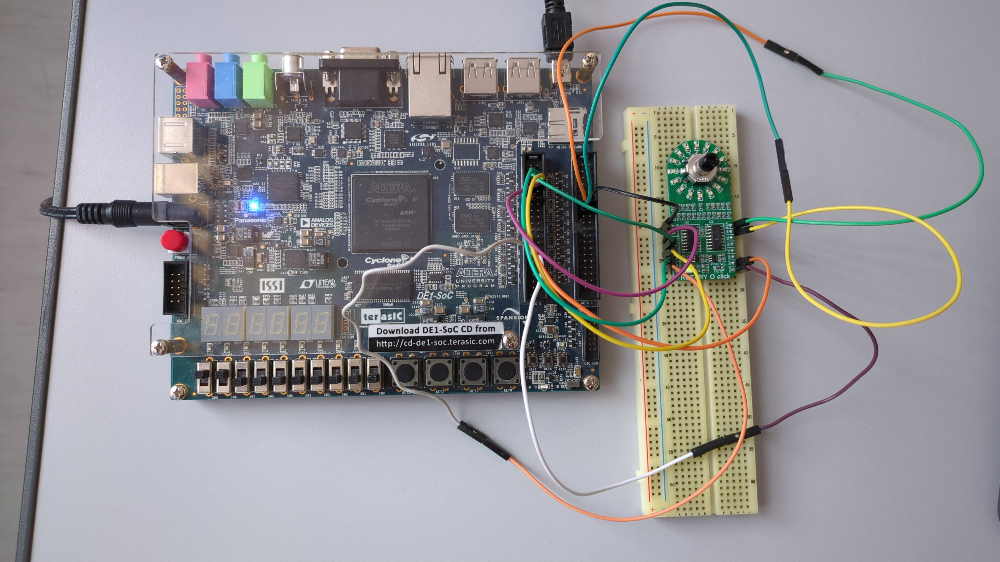
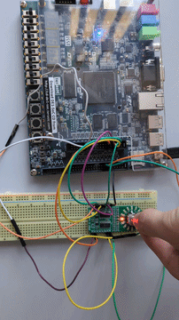

# Integracija Rotary O Click modula na DE1-SoC ploču

U okviru ovog projekta potrebno je integrisati
[Rotary O Click](https://www.mikroe.com/rotary-o-click) modul
na DE1-SoC platformu. Rotary O Click je modul koji na sebi
posjeduje kombinaciju 3 komponente:
- Rotorski enkoder [EC12D1564402](https://download.mikroe.com/documents/datasheets/EC12D1564402_datasheet.pdf) visoke preciznosti,
- Prsten sačinjen od 16 LED dioda, kontrolisanih pomoću
dva 74HC595 SPI 8-bit shift registra,
- Dugme.

Projekat je realizovan u okviru kursa **Ugrađeni računarski sistemi**
na Elektrotehničkom fakultetu Univerziteta u Banjoj Luci.

## Sadržaj

1. [Preduslovi](#preduslovi)
2. [Hardversko povezivanje](#hardversko-povezivanje)
3. [Konfiguracija](#konfiguracija)
   - [Toolchain](#toolchain)
   - [Bootloader](#bootloader)
   - [Linux jezgro](#linux-jezgro)
   - [Device tree](#device-tree)
   - [Buildroot](#buildroot)
4. [Build sekvenca](#build-sekvenca)
5. [Aplikacija](#aplikacija)
6. [Demonstracija rada](#demonstracija-rada)
7. [Upotreba AI alata](#upotreba-ai-alata)

## Struktura projekta
```
$ tree
.
├── README.md
├── buildroot
│   ├── board
│   │   └── terasic
│   │       └── de1soc_cyclone5
│   │           ├── boot-env.txt
│   │           ├── de1_soc_defconfig
│   │           ├── genimage.cfg
│   │           ├── patches
│   │           │   └── uboot
│   │           │       └── de1soc_handoff.patch
│   │           ├── qts
│   │           │   ├── iocsr_config.h
│   │           │   ├── pinmux_config.h
│   │           │   ├── pll_config.h
│   │           │   └── sdram_config.h
│   │           ├── socfpga.rbf
│   │           └── socfpga_cyclone5_de1_soc.dts
│   └── configs
│       └── terasic_de1soc_cyclone5_defconfig
└── userspace
    ├── Makefile
    └── main.c

10 directories, 14 files
```

## Preduslovi

### Hardverski
- Terasic DE1-SoC CycloneV ploča,
- Rotary O Click modul,
- Micro SD kartica,
- Host računar

### Softverski
- git,
- gcc,
- Linux operativni sistem na Host računaru,
- Svi paketi navedeni na ovom [linku](https://buildroot.org/downloads/manual/manual.html#requirement-mandatory)

## Hardversko povezivanje

Rotary O Click je povezan na **GPIO_0** i **GPIO_1** 
konektore DE1-SoC ploče,
na kojem su pored HPS periferija (I2C2/UART1/SPI0/CAN0,
eksportovanih kroz FPGA fabric) izvedeni i pinovi Altera PIO
IP komponente (`gpio_altr`) realizovane u FPGA
dijelu čipa. Enkoderski kanali i dugme su povezani na
`gpio_altr` (izveden na GPIO_1), dok se LED prsten 
kontroliše preko SPI0 (izveden na GPIO_0).

| Signal Rotary O Click-a   | Povezano na               | Opis                                   |
| ------------------------- | ------------------------- | -------------------------------------- |
| ENCA                      | `gpio_altr`, offset 0     | Kanal A rotorskog enkodera             |
| ENCB                      | `gpio_altr`, offset 1     | Kanal B rotorskog enkodera             |
| SW (dugme)                | `gpio_altr`, offset 2     | Taster enkodera                        |
| SDI / SDO / SCK / CS      | SPI0 (spidev0.0)          | SPI linija za 74HC595 shift registre   |
| VCC / GND                 | 3.3V / 5V / GND (GPIO_1)  | Napajanje modula                       |



## Konfiguracija

### Toolchain
Za generisanje toolchain-a potrebnog za kros-kompajliranje
korišten je Crosstool-NG alat, sa podešenim arm-linux- prefiksom.

Prije bilo kakvog build-a ili ručnog kros-kompajliranja
(npr. `userspace` aplikacije),
potrebno je da putanja do toolchain-a bude u `PATH`-u:
```
export PATH=${HOME}/x-tools/arm-etfbl-linux-gnueabihf/bin:$PATH
```

### Bootloader
Kao bootloader koristi se U-Boot, verzija 2024.01. U-Boot koristi
fajl `buildroot/board/terasic/de1soc_cyclone5/boot-env.txt` koji definiše
U-Boot okruženje za
automatsko učitavanje slike jezgra, device tree-a i root filesystem-a.

Prilikom konfiguracije U-Boot-a potrebno je navesti putanju do
direktorijuma sa patch-evima:
```
buildroot/board/terasic/de1soc_cyclone5/patches/uboot/
```

### Linux jezgro
Verzija Linux jezgra korištena je socfpga-6.1.38-lts. Prilikom
konfiguracije potrebno je omogućiti sljedeće opcije (`make linux-menuconfig`):

```
Device Drivers  --->
  <*> GPIO Support  --->
      <*> Memory mapped GPIO drivers --->
          <*> Altera GPIO
  Input device support  --->
      <*> Generic input layer
      Miscellaneous devices  --->
          <*> Rotary encoders connected to GPIO pins  --->
      Keyboards  --->
          <*> GPIO Buttons
  SPI support  --->
      <*> User mode SPI device driver support
```

Ove opcije su već sačuvane u
`board/terasic/de1soc_cyclone5/de1_soc_defconfig`, pomocu
`make linux-update-defconfig` komande.

### Device tree

Custom device tree se nalazi u
`buildroot/board/terasic/de1soc_cyclone5/socfpga_cyclone5_de1_soc.dts`.
Ključni dodaci u odnosu na baseline dts:

```dts
soc {
    gpio_altr: gpio@ff200000 {
        compatible = "altr,pio-1.0";
        reg = <0xff200000 0x10>;
        #gpio-cells = <2>;
        gpio-controller;
        altr,ngpio = <16>;
        interrupts = <0 40 3>;
        altr,interrupt-type = <IRQ_TYPE_EDGE_BOTH>;
        #interrupt-cells = <2>;
        interrupt-controller;
        status = "okay";
    };
};

rotary-encoder {
    compatible = "rotary-encoder";
    gpios = <&gpio_altr 0 GPIO_ACTIVE_HIGH>,
            <&gpio_altr 1 GPIO_ACTIVE_HIGH>;
    linux,axis = <0>;
    rotary-encoder,encoding = "gray";
    rotary-encoder,steps-per-period = <2>;
    rotary-encoder,relative-axis;
    status = "okay";
};

gpio-keys {
    compatible = "gpio-keys";

    button_click {
        label = "Rotary O click button";
        gpios = <&gpio_altr 2 0>;
        linux,code = <17>;
        status = "okay";
    };
};

&spi0 {
    status = "okay";

    spidev@0 {
        compatible = "rohm,dh2228fv";
        reg = <0>;
        spi-max-frequency = <1000000>;
    };
};
```

### Buildroot
Kao alat za automatizaciju procesa izgradnje Linux ugrađenog sistema
koristimo Buildroot, verziju 2024.02.

Prvo klonirati Buildroot i prebaciti se na korištenu verziju:
```
git clone https://gitlab.com/buildroot.org/buildroot.git
cd buildroot
git checkout 2024.02
```

Zatim iz ovog repozitorijuma prekopirati cijeli `board` direktorijum (dts,
patch-evi, qts fajlovi, `socfpga.rbf`, `genimage.cfg`, `boot-env.txt`, kao i
Linux kernel `de1_soc_defconfig`), kao i Buildroot-ov vlastiti
`terasic_de1soc_cyclone5_defconfig`, u Buildroot instalaciju:
```
cp -r buildroot/board/terasic/de1soc_cyclone5 <putanja-do-buildroot>/board/terasic/
cp buildroot/configs/terasic_de1soc_cyclone5_defconfig <putanja-do-buildroot>/configs/
```

Učitati konfiguraciju:
```
make terasic_de1soc_cyclone5_defconfig
```

Ovaj defconfig (isti postupak kao u lab-08 vježbi, generisan komandom
`make savedefconfig BR2_DEFCONFIG=configs/terasic_de1soc_cyclone5_defconfig`)
uključuje sljedeća ključna podešavanja:
- **Toolchain** ---> putanja do korištenog toolchain-a,
- **Bootloaders** ---> U-Boot ---> in-tree defconfig `socfpga_de1_soc`,
  patch direktorijum `board/terasic/de1soc_cyclone5/patches/uboot`,
- **Kernel** ---> repozitorijum/verzija `socfpga-6.1.38-lts`, Configuration
  file path `board/terasic/de1soc_cyclone5/de1_soc_defconfig`, out-of-tree
  DTS `board/terasic/de1soc_cyclone5/socfpga_cyclone5_de1_soc.dts`,
- **System configuration** ---> Root filesystem overlay directories:
  `board/terasic/de1soc_cyclone5/rootfs-overlay` (koristi se za dodavanje
  kompajlirane `userspace` aplikacije u finalnu sliku — vidi
  [Aplikacija](#aplikacija)).

Ako je na vašem računaru potrebno nešto prilagoditi (npr. putanja do
toolchain-a), to se radi kroz `make menuconfig`, a izmjene se čuvaju nazad
istom komandom kojom je defconfig i generisan.

## Build sekvenca

Pošto se DTS, U-Boot patch i FPGA image mijenjaju u odnosu na keširane
verzije, potrebno je eksplicitno očistiti odgovarajuće pakete prije
svakog punog build-a:
```
make uboot-dirclean
make linux-dirclean
make host-uboot-tools-dirclean
make
```

Sastavljanje finalne SD kartične slike je u potpunosti automatizovano
pomoću `genimage.cfg` (`buildroot/board/terasic/de1soc_cyclone5/genimage.cfg`),
koji se pokreće kao dio Buildroot-ovog post-image koraka. Ovaj fajl
definiše:
- `boot.vfat` particiju koja već sadrži `zImage`, `socfpga_cyclone5_de1_soc.dtb`
  i `socfpga.rbf` zajedno,
- `uboot` particiju (SPL + puna U-Boot slika),
- `uboot-env` particiju, generisanu iz `boot-env.txt`,
- `rootfs` particiju.

Rezultat je jedinstven `output/images/sdcard.img`, koji je dovoljno
snimiti direktno na SD karticu:
```
cd output/images
sudo dd if=sdcard.img of=/dev/sdX bs=1M
```

> [!NOTE]
> Prije `dd` komande provjeriti da nijedna particija SD kartice nije
> montirana (`sudo umount /dev/sdX*`), i potvrditi tačno ime uređaja (`/dev/sdX`).

## Aplikacija

Korisnička aplikacija (`userspace/main.c`) povezuje rotorski enkoder i
LED prsten:

U `while` petlji se čita vrijednost sa rotorskog enkodera. Kada rotiramo
rotor u smjeru kazaljke na satu, enkoder javlja vrijednost 1 — u tom
slučaju se u shift registre samo dogura još jedan bajt `0xFF` (kada se
šalje jedan bajt, uzima se vrijednost najnižeg bita, pa nije bitno da li
se šalje `0x01` ili `0xFF`). Kada rotiramo rotor u smjeru suprotnom
kazaljci na satu, enkoder javlja vrijednost -1 — u tom slučaju se shift
registri prvo isprazne (popunjavanjem nulama, čime se gase diode), a
zatim se ponovo ugura onoliko `0xFF` vrijednosti koliko iznosi nova,
smanjena pozicija.

Unutar Makefile je već korišten arm-linux-gcc kao kompajler tako da je
za kompajliranje dovoljno samo (uz uslov da je `PATH` već podešen kao u
poglavlju [Toolchain](#toolchain)):
```
cd userspace
make
mkdir -p ../buildroot/board/terasic/de1soc_cyclone5/rootfs-overlay/root
cp rotary-leds ../buildroot/board/terasic/de1soc_cyclone5/rootfs-overlay/root/
```
Fajlovi u `rootfs-overlay` direktorijumu se direktno kopiraju u root
fajl-sistem (putanja je definisana `BR2_ROOTFS_OVERLAY` opcijom u
`terasic_de1soc_cyclone5_defconfig`), pa je nakon ovoga potrebno samo
ponovo pokrenuti build iz Buildroot direktorijuma (rootfs i finalna
slika se ponovo sastavljaju, jezgro se ne mijenja):
```
cd ../buildroot/
make

# Nakon toga, na pokrenutom ugrađenom sistemu:
./rotary-leds
```

### Problem sa dugmetom
Taster modula povezan na `gpio_altr` ne generiše događaje. Ispravnost DTS zapisa i
tačnost fizičkog pina su potvrđene (povezivanje nekog drugog
dugmeta na GPIO 2 pin i njegovo aktiviranje generiše prekide), takođe
osciloskop potvrđuje da taster na Rotary O Click ploči generiše naponske
promjene na svom izlazu. Uprkos tome, ta promjena se ne registruje na
GPIO header pinu. Sumnja se na neusklađenost naponskih nivoa. U
finalnoj aplikaciji se ne oslanja na funkcionalnost tastera.

## Demonstracija rada



## Upotreba AI alata

Tokom rada na projektu korišten je Claude (Anthropic, model Sonnet 5), 
kroz konverzacioni interfejs, kao pomoć pri sljedećim zadacima:

- **Debagovanje FPGA-HPS bridge i GPIO prekida** — tumačenje `dmesg`
  izlaza, izvornog koda `gpio-altera` drajvera i, konkretno, analiza
  generisanog `soc_system.html` izvještaja koji je otkrio da PIO jezgro u
  originalno predatom FPGA image-u nema realizovanu edge-capture logiku
  za prekide.
- **SPI/spidev programiranje u C-u** — objašnjenje `ioctl`/`spi_ioc_transfer`
  API-ja i pomoć pri debagovanju ponašanja shift registra.
- **Struktura i tehnička provjera ovog README fajla** — provjera
  strukture, ispravke gramatičkih grešaka, kao i tehničkih grešaka.

Fizičko povezivanje, mjerenja osciloskopom, iterativno testiranje na
samoj ploči, kao i konačna
implementacija i sve odluke o sadržaju ovog dokumenta, urađeni su
samostalno.
